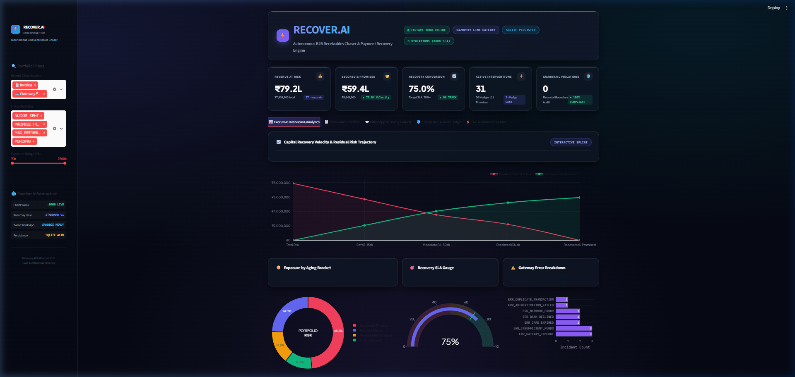
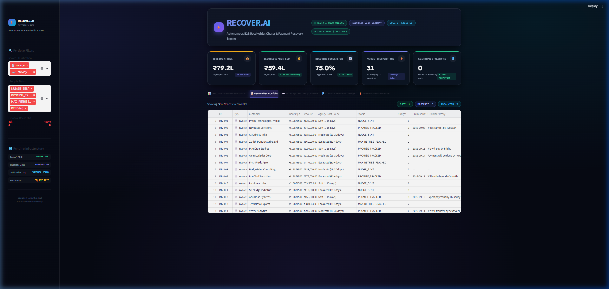
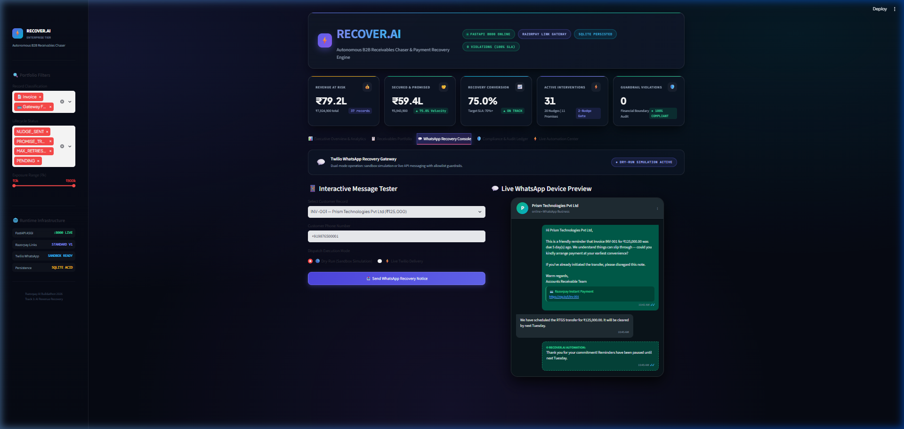
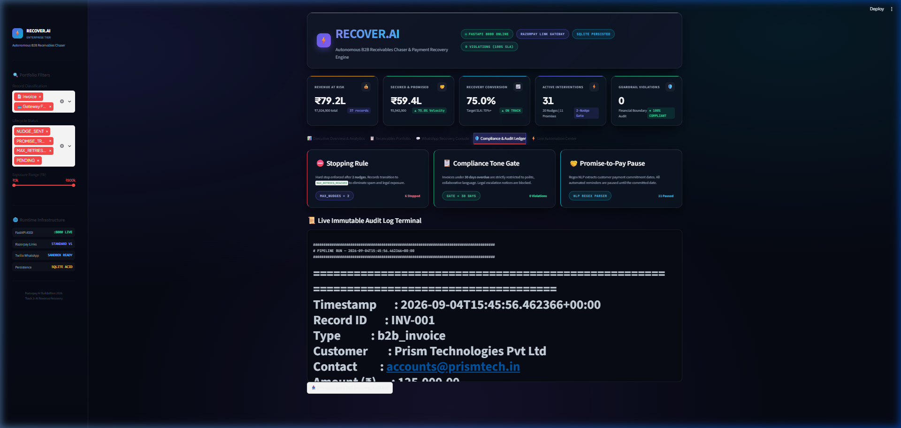
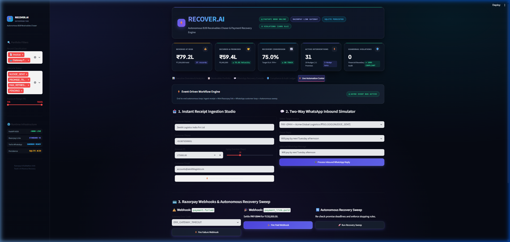

# ⚡ RECOVER.AI — Autonomous B2B Revenue Recovery Platform
> **Enterprise Walkthrough & UI Showcase**  
> Razorpay AI Buildathon 2026 — Track 3: AI Revenue Recovery

An ultra-premium, executive-grade FinTech dashboard inspired by **Stripe Sigma, Linear, Ramp, and Mercury**.

---

## 🖥️ Executive Mission Control & Visual Showcase

The interface runs locally at **`http://localhost:8501`** and operates as a unified executive control room across five operational panels:

---

### 1. 📊 Executive Overview & Interactive Financial Analytics



#### Top Executive Branding Header
- **RECOVER.AI** branding with enterprise gradient badge
- Live system status pills:
  - `● FASTAPI 8000 ONLINE` (Pulsing live indicator)
  - `RAZORPAY LINK GATEWAY` (Active standard payment links)
  - `SQLITE PERSISTED` (ACID-compliant storage)
  - `0 VIOLATIONS (100% SLA)` (Guaranteed bounded financial guardrails)

#### 5 Master KPI Hero Cards
- **Revenue at Risk**: `₹79.2L` (`₹7,924,900` across 37 active records)
- **Secured & Promised**: `₹59.4L` (`₹5,943,900` with ▲ 75.0% velocity)
- **Recovery Conversion**: `75.0%` (Target SLA: 70%+ — **▲ ON TRACK**)
- **Active Interventions**: `31` (20 Nudges sent, 11 Promises paused under 2-nudge gate)
- **Guardrail Violations**: `0` (**● 100% COMPLIANT** with zero financial spam or compliance breaches)

#### Dark-Mode Financial Visualizations (Plotly)
- **Capital Recovery Velocity & Residual Risk Trajectory**: Area spline curve tracking capital at risk vs. recovered & promised across aging cohorts.
- **Exposure by Aging Bracket**: Multi-color donut chart with centered summary (`PORTFOLIO RISK`).
- **Recovery SLA Gauge**: Semicircular progress gauge tracking conversion against SLA thresholds.
- **Gateway Error Breakdown**: Horizontal bar chart diagnosing payment degradation root causes.

---

### 2. 📋 Receivables Portfolio & Batch Explorer



- Interactive high-density data table with customer name, contact details, exposure amount in INR (`₹`), aging bracket classification, lifecycle status, nudge count, and promise date.
- Quick filter pills for `SOFT (1-15d)`, `MODERATE (16-30d)`, and `ESCALATED (31+d)`.

---

### 3. 💬 WhatsApp Recovery Console & Mobile Mockup



- **Interactive Message Tester**: Select any customer receivable, customize contact phone number, and dispatch via dry-run simulation or live Twilio WhatsApp delivery.
- **Authentic WhatsApp Device Preview**:
  - Dark-mode phone canvas with contact avatar, green online status badge, and WhatsApp Business branding.
  - Outbound recovery notice bubble (`#005C4B`) embedding active **Razorpay Instant Payment link cards**.
  - Inbound customer response bubble (`#202C33`) showing customer commitment.
  - Automated bot confirmation bubble acknowledging promise dates and confirming paused nudges.

---

### 4. 🛡️ Compliance & Audit Ledger



- **Three Hard Guardrail Policy Cards**:
  1. ⛔ **Stopping Rule**: Hard block after 2 nudges (`MAX_RETRIES_REACHED`).
  2. 📋 **Compliance Tone Gate**: Age-gated messaging strictly preventing legal escalation under 30 days.
  3. 🤝 **Promise-to-Pay Pause**: NLP regex extraction automatically freezing reminders until customer commitment date.
- **Monospace Audit Terminal**: Live streaming viewer of `logs/recovery_audit.log` with search, line count controls, and direct download.

---

### 5. ⚡ Live Automation & Webhook Control Center



- **Instant Receipt Ingestion Studio**: Form to ingest invoices, auto-calculate aging brackets, and mint Razorpay payment links.
- **Two-Way WhatsApp Inbound Simulator**: Test customer replies (e.g. *"Will pay by next Tuesday afternoon"*) with instant NLP date extraction.
- **Razorpay Webhook Simulator**: Trigger simulated `payment.failed` (causing root-cause diagnosis & link generation) or `payment_link.paid` (auto-resolving the debt).
- **Autonomous Recovery Sweep**: Background scheduler sweep evaluating all records and enforcing stopping rules.
- **Live SQLite Database Stream**: Real-time inspection table displaying SQLite state changes instantly.

---

## 🎥 Full UI Inspection Recording


---

## 🚀 How to Launch the Complete Stack

```bash
# 1. Start the FastAPI Webhook Server (Port 8000)
cd revenue_recovery_engine
python server.py

# 2. In a separate terminal, launch the Streamlit Dashboard (Port 8501)
streamlit run dashboard.py

# 3. Access URLs:
#    Dashboard:        http://localhost:8501
#    FastAPI & Docs:   http://localhost:8000/docs
```
