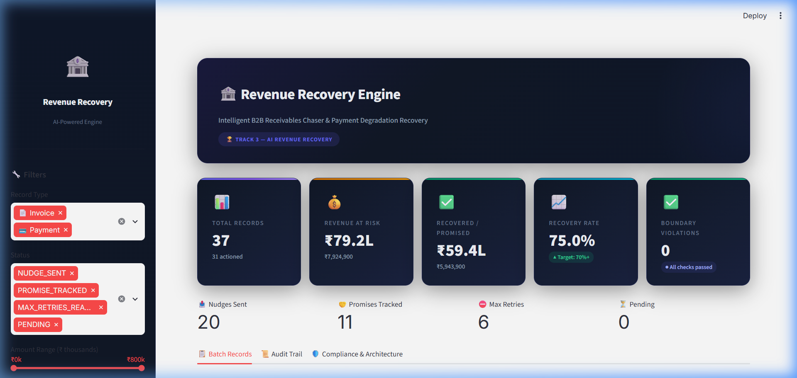
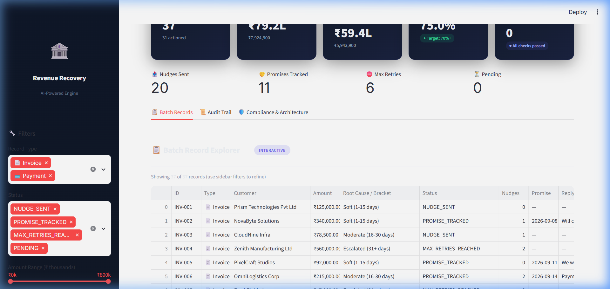
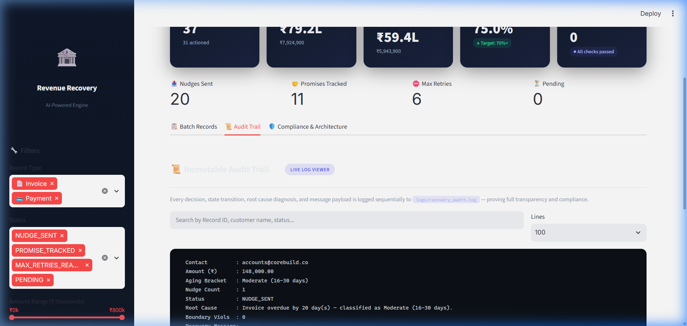
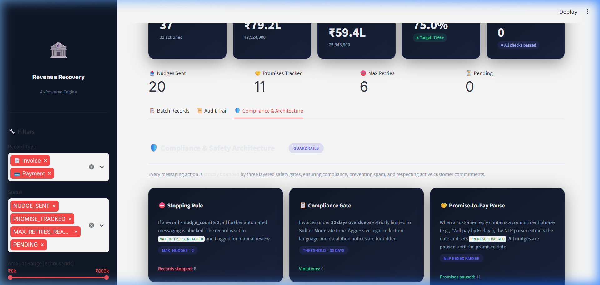
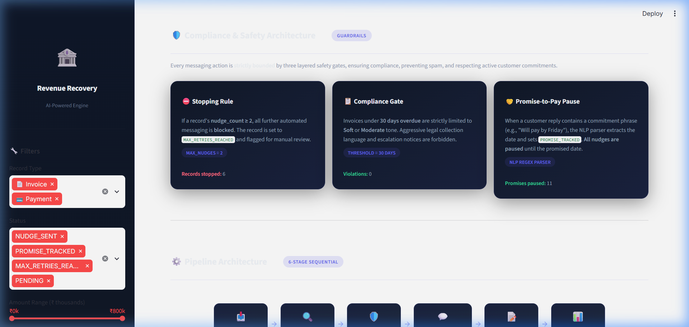
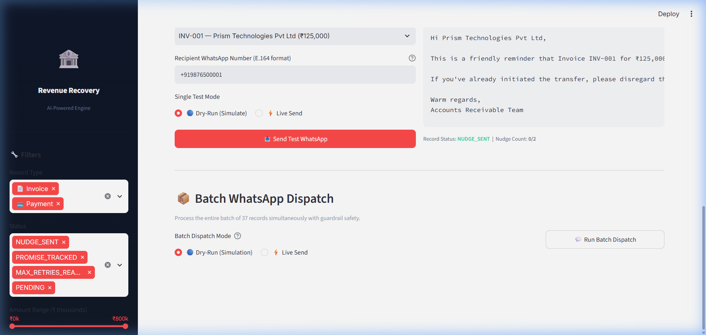
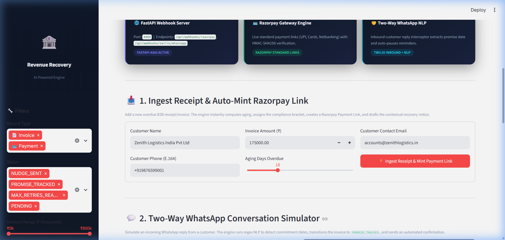
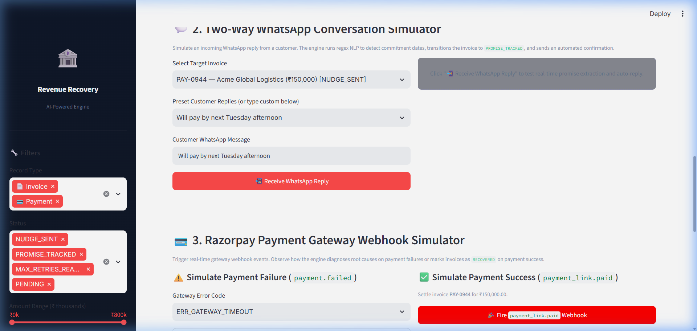
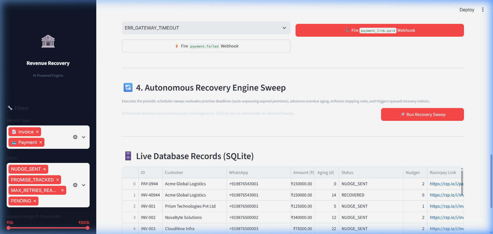
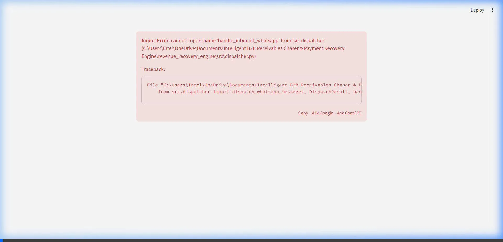

# 🏦 Revenue Recovery Dashboard & Automation Platform — Walkthrough

> **Interactive Walkthrough of the Intelligent B2B Receivables Chaser & Payment Recovery Engine**  
> Razorpay AI Buildathon 2026 — Track 3: AI Revenue Recovery

---

## 🖥️ Executive Dashboard Overview

The Streamlit dashboard runs locally at **`http://localhost:8501`** and provides an executive view across five operational panels:

---

### 1. 📊 Top-Level KPI Cards



Five executive KPI cards with real-time portfolio metrics:
- **37** Total Records Tracked
- **₹79.2L** Revenue at Risk
- **₹59.4L** Recovered / Promised
- **75.0%** Recovery Rate
- **0** Boundary Violations *(Strictly 0 compliance violations enforced)*

Secondary status badges: **20 Nudges Sent**, **11 Promises Tracked (Paused)**, **6 Max Retries Reached**, and **0 Pending**.

---

### 2. 📋 Interactive Batch Record Explorer



Filterable, real-time data table displaying each receivable or failed transaction:
- Filter by Record Type (Invoices vs. Gateway Failures)
- Filter by Status (`NUDGE_SENT`, `PROMISE_TRACKED`, `MAX_RETRIES_REACHED`, `RESOLVED`)
- Dynamic amount slider and search

---

### 3. 📜 Live Audit Trail Viewer



Terminal-grade monospace log viewer reading directly from `logs/recovery_audit.log`:
- Complete chronological audit trails for every decision and policy gate
- Text filter and line-limit slider
- Direct download button for auditor compliance reviews

---

### 4. 🛡️ Compliance & Architecture Panel



Documents the engine's hard financial guardrails:
1. **Stopping Rule**: Hard stop at 2 nudges (`MAX_RETRIES_REACHED`).
2. **Compliance Tone Gate**: Age-gated messaging (Soft 1–15d → Moderate 16–30d → Escalated 31+d; legal escalation strictly forbidden under 30 days).
3. **Promise-to-Pay Pause**: Automated pause on any commitment date.



---

### 5. 💬 WhatsApp Recovery Dispatch via Twilio



Integrated with the **Twilio API for WhatsApp**:
- **Single-Message Tester**: Select any customer record, inspect the generated contextual copy, enter an E.164 phone number, and dispatch live or in dry-run mode.
- **Batch Dispatch**: Dispatch all records simultaneously with guardrail protection (records at `MAX_RETRIES_REACHED` are automatically blocked).
- **Safety Allowlist**: Live mode requires `ENABLE_LIVE_WHATSAPP=true` and restricts outbound messages strictly to `ALLOWED_RECIPIENTS` in `.env`.
- **CLI Support**: `python main.py --dispatch` (dry-run) and `python main.py --dispatch --live-whatsapp` (live).

---

### 6. ⚡ Live Automation Center (FastAPI, Webhooks, Razorpay & SQLite)

The production-grade automation center connects receipt ingestion, active Razorpay checkout links, inbound WhatsApp webhooks, and autonomous background sweeps:

#### Live System Status & Instant Receipt Ingestion



- **System Status Cards**: Real-time monitors for the FastAPI server (`ONLINE` on port 8000), Razorpay gateway mode, WhatsApp delivery mode, and live SQLite database record counts.
- **Instant Receipt Ingestion**: Enter an invoice number, customer name, due date, and amount. The engine automatically parses the receipt, computes the aging bracket, and mints an active Razorpay payment link.

#### Two-Way WhatsApp NLP Simulator & Razorpay Webhooks



- **Two-Way WhatsApp NLP Simulator**: Test inbound customer replies (e.g., *"Will pay 25k by next Friday"*). The NLP regex engine parses the date commitment, sets invoice status to `PROMISE_TRACKED`, pauses future nudges, and automatically dispatches an acknowledgement.
- **Razorpay Webhook Simulator**:
  - `payment.failed`: Triggers root-cause error diagnosis (e.g. `ERR_INSUFFICIENT_FUNDS`), generates a diagnostic recovery link, and updates audit records.
  - `payment_link.paid`: Instantly resolves the invoice as `RESOLVED`, clears the debt, and cancels all pending follow-ups.

#### Autonomous Recovery Sweep & Real-Time SQLite Database Stream



- **Autonomous Recovery Sweep**: Re-checks promise deadlines, advances aging brackets, and enforces the strict 2-nudge stopping rule across the entire database with a single click.
- **Live Database Table**: Directly reads from `data/recovery_engine.db` with live payment links, status badges, and timestamp tracking.

---

## 🎥 Dashboard Interaction Recording



---

## 🚀 How to Run

```bash
# 1. Start the FastAPI Webhook & Automation Server
cd revenue_recovery_engine
python server.py

# 2. In a separate terminal, launch the Streamlit Executive Dashboard
streamlit run dashboard.py

# 3. Access URLs:
#    Dashboard:        http://localhost:8501
#    FastAPI & Docs:   http://localhost:8000/docs
```
